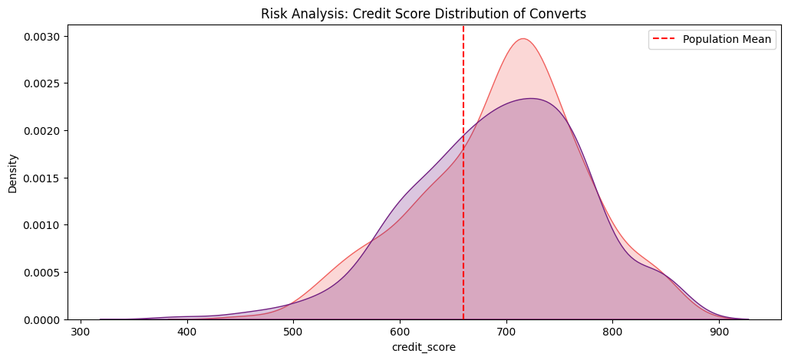
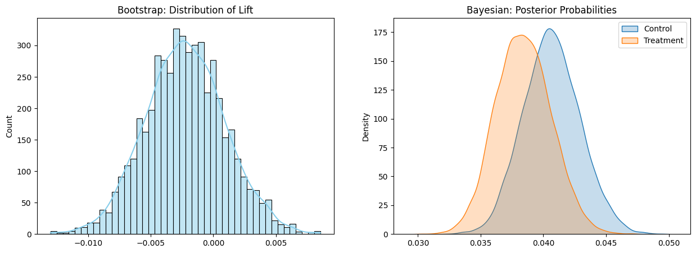

# A/B Testing Framework

## Project Overview
This repository provides a comprehensive end-to-end A/B testing suite designed for the credit and banking industry. In the banking and credit space, A/B testing is about more than just moving conversion metrics—it’s about balancing growth with risk. This repository hosts an end-to-end testing framework I built to evaluate a new UI design for a loan application flow..

## Experimental Results
After analyzing 15,000 banking leads simulated data, the experiment resulted in a **Neutral-to-Negative** outcome. The global results are summarized below:

| Metric | Frequentist (Z-Test) | Bootstrap (5k) | Bayesian Analysis |
| :--- | :--- | :--- | :--- |
| **P-Value / Prob** | 0.4812 | 0.7606 | **23.57% (P > 0)** |
| **Lift / Cred. Int.** | - | [-0.84%, 0.42%] | [-0.85%, 0.40%] |
| **Conclusion** | Not Significant | Not Significant | Stop (Expected Loss > 0) |

## Methodology Highlights
* **Bayesian Posterior Analysis:** I modeled the conversion rates as Beta-Binomial distributions. The resulting **Expected Loss (0.0026)** provided a clear quantitative signal to halt the rollout, protecting the business from potential conversion degradation.
* **Risk Profile Integrity:** I monitored for **Adverse Selection** by plotting the credit score density of successful converters. Ensuring the credit score distribution of the treatment group does not shift toward lower scores is critical for banking compliance.

* **Languages:** Python
* **Libraries:** `Pandas`, `NumPy`, `Statsmodels`, `SciPy`, `Seaborn`, `Matplotlib`
* **Statistical Methods:** Frequentist (Z-test), Non-parametric (Bootstrapping), Bayesian (Beta-Binomial)

# Banking A/B Testing Results

## Visual Analysis
### 1. Risk Profile (Adverse Selection Check)

### 2. Segmented Performance

